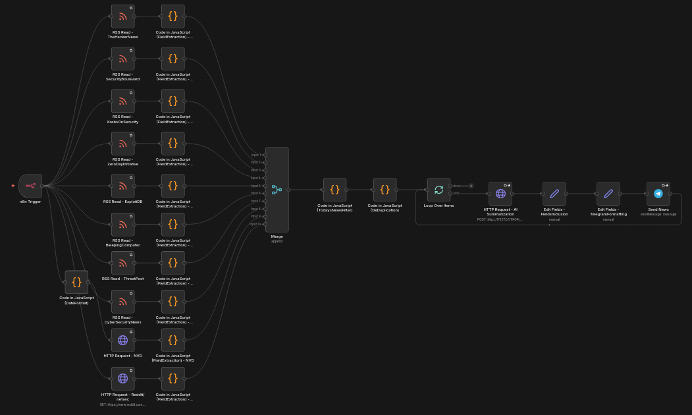

# 📰 CyberDigest (N8N)

An automated **cybersecurity news aggregation, deduplication, summarization, and Telegram alert pipeline** built using **N8N**, multiple RSS feeds, and a **local summarization LLM via HTTP**.

This workflow collects cybersecurity news from trusted sources, removes duplicates, summarizes each article, and can deliver concise alerts to a Telegram channel or group.

---

## 🚀 Features

- 🔗 Aggregates news from **multiple cybersecurity RSS sources**
- 🧹 **Deduplicates similar news articles** (rule-based, non-AI)
- 📅 Filters **only today’s news**
- 🧠 Summarizes articles using a **local LLM HTTP endpoint**
- 🔁 Safe processing of multiple items using loops
- 📢 Sends formatted alerts to **Telegram**
- 💸 **No paid APIs or cloud AI services**

---

## 🏗️ Workflow Architecture

```
RSS Feeds
↓
Field Extraction (JS)
↓
Merge (Append)
↓
Today's News Filter
↓
Deduplication
↓
Loop Over Items
↓
HTTP Summarization (Local LLM)
↓
Telegram Formatting
↓
Telegram Channel / Group
```

<p align="center">
  
</p>

<p align="center">
  <em>Figure 1: Automated Cybersecurity News Aggregation & Summarization Workflow (N8N)</em>
</p>

---

## 🧩 News Sources

The workflow aggregates data from:

- The Hacker News
- Security Boulevard
- Krebs on Security
- BleepingComputer
- Exploit-DB
- ThreatPost
- Cyber Security News
- Zero Day Initiative
- NVD (via HTTP API)
- Reddit (security-focused feeds)

All feeds are normalized into a common structure.

---

## 🧠 Deduplication Logic

To prevent duplicate or near-duplicate news:

- Normalize titles and descriptions
- Generate a unique signature/hash
- Drop articles with matching signatures

#### Benefits

✔ Detects same vulnerability reported by multiple sources
✔ Deterministic and fast
✔ No AI dependency

---

## 🤖 Summarization Engine

Summarization is performed using an HTTP Request node pointing to a local LLM (e.g., Ollama).

Prompt:
```
You are a senior cybersecurity analyst. Summarize the following article in 2–3 sentences (25–40 words). Focus on impact, affected systems, and why it matters.
```

#### Benefits

✔ Fully local
✔ No API keys
✔ Privacy friendly

## 📢 Telegram Message Format

Each alert is sent in the following format:

```
<----<Title>---->

<Response Summary>

Link: <Link>
```

<p align="center">
  
</p>

<p align="center">
  <em>Figure 2: Sample messages from N8N CyberDigest project workflow. (Telegram)</em>
</p>

## ⚙️ N8N Nodes Used

- RSS Read
- HTTP Request
- Code (JavaScript)
- Merge (Append)
- Loop Over Items
- Set / Edit Fields
- Telegram

## 🐳 Deployment

- n8n (Docker / Self-hosted)
- Local LLM (Docker-based, e.g., Ollama)
- Telegram Bot API

## 📌 Use Cases

- Daily cybersecurity threat alerts
- SOC & blue-team awareness feeds
- Security research automation
- Community Telegram channels
- Personal threat intelligence dashboard
